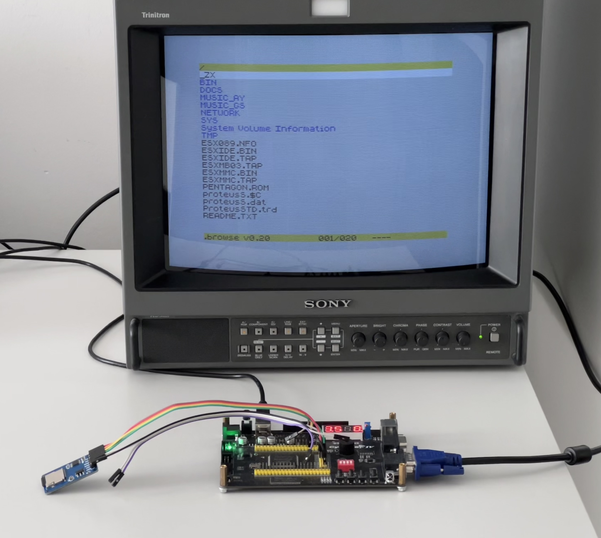
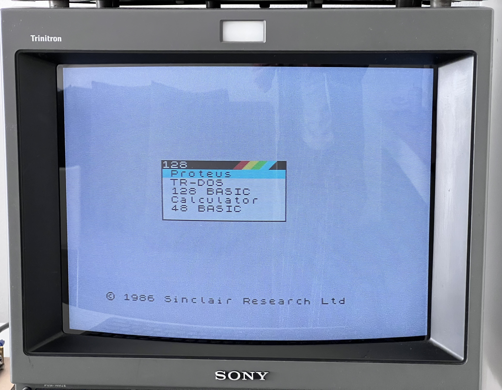
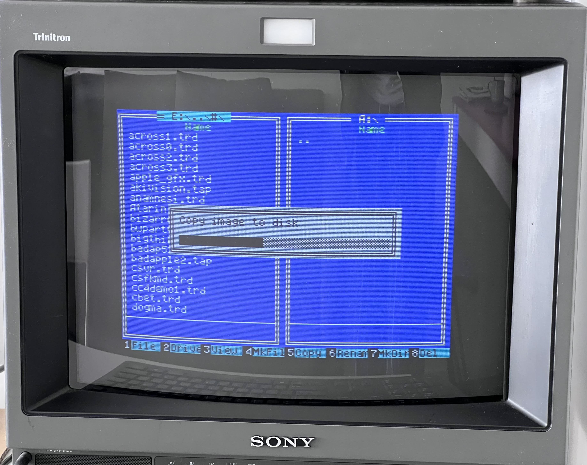
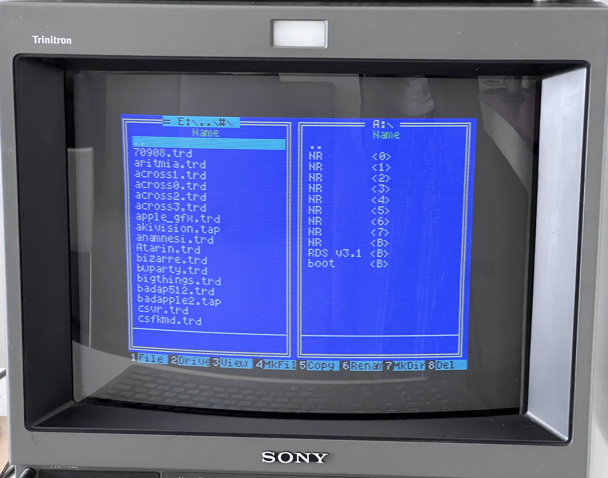
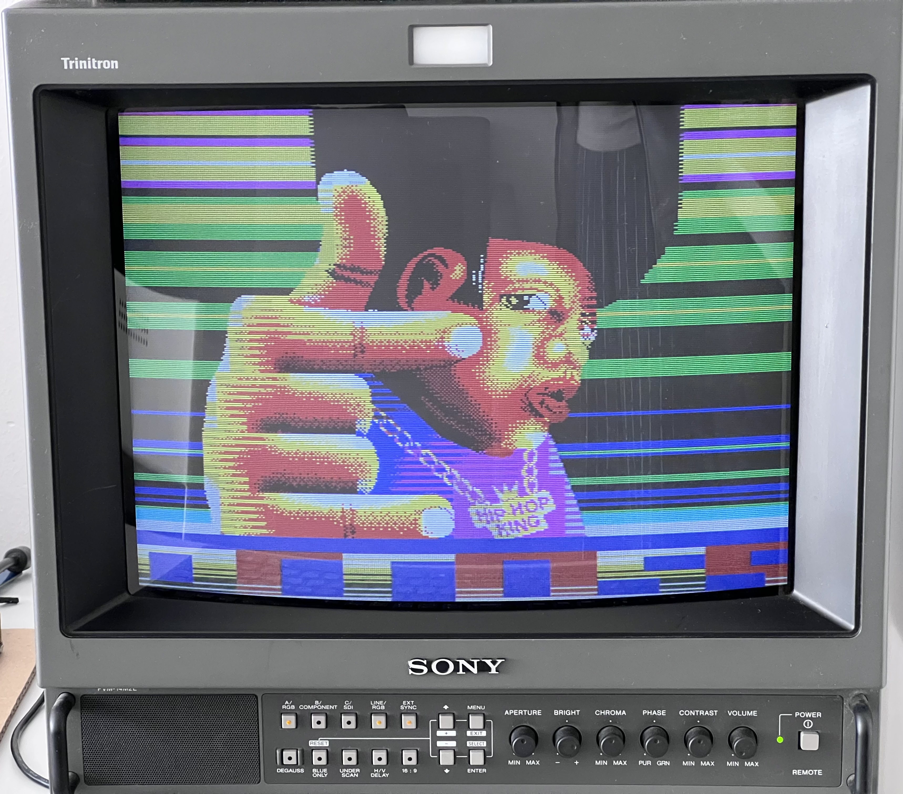
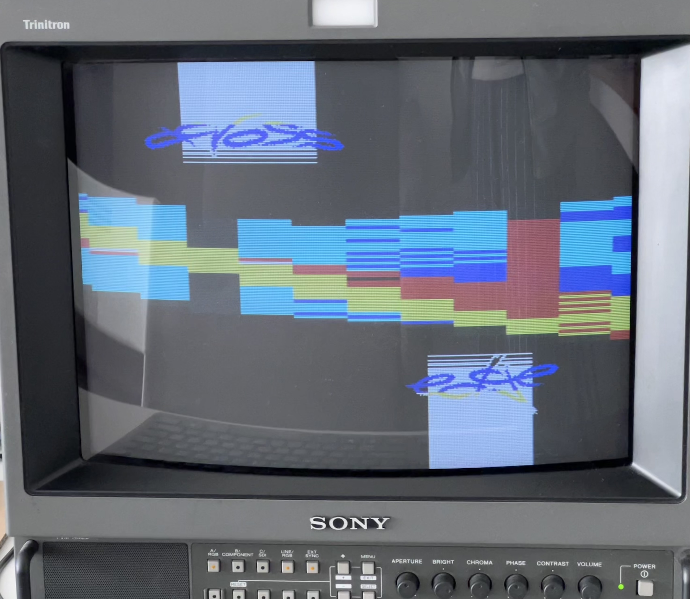
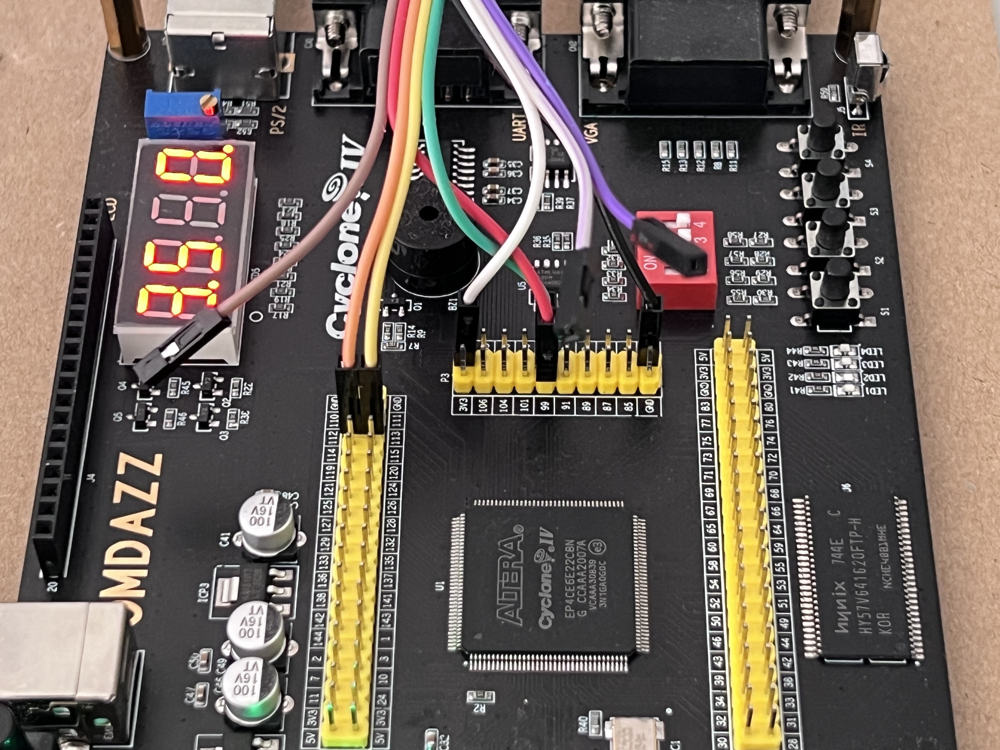

# ZX Spectrum на плате EP4CE6E22C8

**Цель проекта — собрать Sinclair Spectrum на дешёвой отладочной плате:
без пайки и без затрат.** Нужны только сама плата
**OMDAZZ / RZ-EasyFPGA A2.2** (Altera Cyclone IV E, EP4CE6E22C8),
клавиатура PS/2, модуль SD-карты и несколько проводов-перемычек. Паяльник
не требуется: SD-карта подключается к разъёму I²C готовыми проводами, всё
остальное на плате уже разведено.

Ядро происходит от [ZX Spectrum для MiST](https://github.com/mist-devel/mist-board),
в свою очередь основанного на «ZX Spectrum for Altera DE1» Майка Стирлинга.



## Плата


Из того, что есть на плате, задействовано: 50 МГц кварц, SDRAM 64 Мбит,
разъём PS/2, VGA, пьезоизлучатель, четыре кнопки, четыре светодиода,
семисегментный индикатор и разъём I²C — его четыре вывода переиспользованы
под SD-карту.

## Что реализовано

**Процессор.** T80 (Z80-совместимое ядро) с тактовой частотой
**3.5 / 7 / 14 / 28 МГц**, переключаемой на лету. Смена скорости
происходит только на безопасной границе: когда не открыт ни один цикл
обращения к памяти или порту и снят WAIT.

**Модели машины,** переключаются на лету без сброса:

| модель | кадр | строка | прерывание |
|---|---|---|---|
| Sinclair 48K | 69888 тактов | 224 такта | строка 248 |
| Sinclair 128K / +2 | 70908 | 228 | строка 245 |
| Sinclair +2A / +3 | 70908 | 228 | строка 245 |
| Pentagon 128K | 71680 | 224 | строка 239 |

**Contention ULA.** Опубликованная таблица задержек `6,5,4,3,2,1,0,0`,
128 тактов из 224 на каждой из 192 строк изображения. Отдельно
обрабатывается contention портов ввода-вывода по четырём случаям
(`N:1,C:3` / `N:4` / `C:1,C:3` / `C:1×4`). На Pentagon contention нет,
как и на настоящей машине. Режим переключается с клавиатуры — это
рабочий инструмент для сверки таймингов с эталоном.

**Память.** Одна микросхема SDRAM обслуживает и процессор, и видео через
арбитр со слотами. На Pentagon доступно расширение до 1024 КБ.

**Видео.** Выход VGA. Машина **всегда** работает на родных 15.625 кГц, а
31 кГц получается скандаблером уже после вывода — строчным буфером,
который показывает каждую строку дважды. Это сделано именно так, чтобы
видеорежим не влиял на работу компьютера: окно contention, положение
прерывания и сетка групп бордюра считаются одним и тем же счётчиком, и
удвоение его шага сдвинуло бы их все. Переключение — **Scroll Lock**.

На плате по одному выводу на цвет, то есть физически доступны восемь
базовых цветов — но яркость всё равно воспроизводится
широтно-импульсной модуляцией. Период ШИМ равен ровно одному пикселю:
на 15 кГц пиксель длится восемь шагов счётчика 56 МГц, в удвоенном
режиме четыре. Яркий цвет держит вывод весь период, обычный — три
четверти, что близко к отношению между двумя уровнями настоящего
Спектрума. Монитор усредняет, и на экране получаются все **15 цветов**,
а не восемь.

Реализованы бордюр с корректной задержкой, порт 0xFF (floating bus) и
эффект snow: в цикле M1 процессор выставляет на шину адрес регенерации
`I:R`, и если `I` попадает в $40–$7F, ULA берёт младший байт этого
адреса вместо своего — испорченный байт приходит из того же
256-байтного блока, и рябь ползёт вслед за регистром `R`.

**Экранная строка.** В верхнем бордюре одной строкой показываются
частота, тип машины и объём памяти. Появляется при изменении любого из
трёх, а также по **Print Screen**: полсекунды держится старое значение,
затем секунда нового, затем гаснет — смена на глазах говорит больше,
чем значение, которое просто возникло. Знаки берутся из родного
знакогенератора ПЗУ по $3D00, только нужные тридцать, поэтому строка
стоит около 260 логических элементов и ни одного блока памяти. На
тайминги не влияет: это мультиплексор на выходах цвета, после всей
цепочки выборки и контроля.

**Звук.** AY-3-8912 (через YM2149) в конфигурации Turbo Sound плюс
бипер, сведённые в моно и выведенные на пьезоизлучатель через
однобитный сигма-дельта ЦАП.

**DivMMC + ESXDOS.** SD-карта подключается к четырём выводам разъёма
I²C. Образ ESXDOS зашит в блочную память и при включении копируется в
SDRAM небольшим автоматом. Автомаппер работает на всех частотах,
включая 28 МГц.

**ПЗУ с карты.** Образы 128K, Pentagon и TR-DOS не зашиваются в ПЛИС, а
грузятся с SD-карты в слоты SDRAM программой из ESXDOS. Область ПЗУ при
этом остаётся недоступной для записи со стороны процессора: байты идут
через отдельный порт-канал.



**Страничная память +2A/+3.** Порт `$1FFD` и его режим «вся память
ОЗУ»: ПЗУ убирается из `$0000–$3FFF`, и все четыре блока становятся
оперативной памятью в одной из четырёх раскладок, выбираемой битами 2:1.

**Достоверность Pentagon.** Машина отвечает на опрос портов так же, как
настоящая: порт атрибутов на 0xFF не реализован, дешифрация порта
0x7FFD неполная, сам 0x7FFD на чтение недоступен.

**Клавиатура.** PS/2 напрямую с разъёма платы.

### Когда DivMMC не подходит

Часть софта с DivMMC не работает — прежде всего демки и всё, что
писалось под Pentagon с TR-DOS. Причина в самом устройстве DivMMC: он
перехватывает выборки команд по фиксированным адресам и подменяет собой
`$0000–$3FFF`, а программа, которая рассчитывает видеть там ПЗУ машины,
этого не ждёт. Для таких случаев на плате есть два других пути, и ни
один из них не трогает карту памяти вовсе.

**Z-Controller.** Та же SD-карта, но через два порта Pentagon: `$77` —
питание карты и выбор кристалла, `$57` — байт через SPI. Ни автомаппера,
ни ловушек, ни подмены `$0000–$3FFF`: весь класс отказов, который
приносит с собой автомаппер, здесь не может возникнуть по устройству.

**Виртуальные флоппи-диски.** Эмуляция контроллера VG93 с четырьмя
приводами. Образ `.trd` лежит в SDRAM, и TR-DOS читает его как
настоящую дискету: сектор — это `(дорожка × стороны + сторона) × 16`
по 256 байт. Секторы можно не только читать, но и писать, поэтому привод
B оказывается RAM-диском, не стоящим машине ни байта её собственной
памяти.

Вместе это даёт привычный рабочий порядок: файловый менеджер видит
карту в одной панели и виртуальную дискету в другой, образ копируется на
диск —



— и дальше диск читается как обычный, со своим каталогом TR-DOS:



Так и запускается всё остальное. **Across** — демка для Pentagon 128K:
образ `.trd` скопирован на виртуальный диск, дальше её грузит TR-DOS.
Многоцветные картинка и бордюр здесь нарисованы счётом тактов
процессора, то есть держатся на таймингах Пентагона.





## Управление

### Функциональные клавиши PS/2

| клавиша | действие |
|---|---|
| F1 / F2 / F3 / F4 | тактовая частота 3.5 / 7 / 14 / 28 МГц |
| F5 / F6 / F7 / F8 | модель: 48K / 128K / +2A+3 / Pentagon |
| F9 | расширение 1024 КБ (только на Pentagon) |
| F10 | режим contention: полный → выключен → только память |
| F11 | сброс |
| F12 | NMI (вход в меню ESXDOS) |
| Print Screen | показать экранную строку |
| Scroll Lock | видеорежим 15 кГц ↔ 31 кГц |

Смена модели, частоты или объёма памяти показывает экранную строку в
верхнем бордюре: полсекунды прежнее значение, секунду новое.

**F11 с зажатым пробелом** стирает флаги загруженных слотов ПЗУ, и
машина поднимается на DivMMC с ESXDOS — дорога обратно, когда ПЗУ
загружено с карты и автомаппер стоит в стороне.

Смена модели намеренно **не сбрасывает** машину, чтобы можно было
наблюдать эффект на работающей программе. Смена объёма памяти при этом
почти наверняка уронит программу — банки уезжают у неё из-под ног;
для сброса есть F11.

### Кнопки платы

| кнопка | действие |
|---|---|
| KEY1 | сброс |
| KEY3 / KEY4 | сдвиг окна contention на такт назад / вперёд |

Кнопка **KEY2 не задействована**: её вывод 89 не имеет подтяжки, и
Quartus отказывается её назначить — «weak pullup not supported by this
pin location». Вход висит в воздухе, и повесить на него прерывание
нельзя: подключить кнопку пробовали дважды, оба раза NMI начинал
срабатывать не с первого нажатия. Для NMI есть F12.

### Светодиоды

Активны низким уровнем. Нумерация на шёлкографии платы идёт **в обратном
порядке** к индексам `LED[]` в исходниках, поэтому ниже указана функция
и вывод ПЛИС:

| сигнал | вывод | горит, когда |
|---|---|---|
| `LED[3]` | 84 | активен DivMMC |
| `LED[2]` | 85 | contention только по памяти |
| `LED[1]` | 86 | contention выключена |
| `LED[0]` | 87 | включено расширение 1024 КБ |

Полный contention — состояние, в котором `LED[1]` и `LED[2]` погашены.

## Распиновка


Задействованные выводы:

| назначение | выводы |
|---|---|
| Кварц 50 МГц | 23 |
| Кнопки KEY1..KEY4 | 88, 89, 90, 91 |
| Светодиоды | 87, 86, 85, 84 |
| VGA HS / VS / R / G / B | 101, 103, 106, 105, 104 |
| PS/2 CLK / DATA | 119, 120 |
| Пьезоизлучатель | 110 |
| SD SCK / MOSI / CS / MISO | 112, 113, 99, 98 |
| SDRAM | шина данных, адреса и управления |

SD-карта подключена к разъёму I²C: `SCL` → SCK, `SDA` → MOSI,
`I2C_SCL` → CS, `I2C_SDA` → MISO. Паять ничего не нужно — обычные
провода-перемычки с модуля карты на штыревые разъёмы платы:



## Подготовка SD-карты

Карта нужна обычная, разметка — **FAT32**. Содержимое стандартное для
ESXDOS: каталоги `SYS`, `BIN`, `TMP` и всё, что вы захотите положить
рядом. Готовый набор собран в архиве `sdcard/sdcard.zip` — с ESXDOS,
точечными командами, ПЗУ для загрузки в слоты и демками. Достаточно
**отформатировать карту в FAT32 и распаковать архив в её корень**,
настраивать больше нечего.

### Автозагрузка

Чтобы ПЗУ 128K, Pentagon и TR-DOS попадали в слоты сами при включении,
нужны две вещи:

1. Положить [sdcard/sys/AUTOBOOT.BAS](sdcard/sys/AUTOBOOT.BAS) в каталог
   `SYS` на карте.
2. В файле `SYS/CONFIG/ESXDOS.CFG` прописать строку `AutoBoot=1`.

После этого ESXDOS выполняет `AUTOBOOT.BAS` при старте, и загрузчик
раскладывает образы по слотам без единого нажатия. Без автозагрузки то
же самое делается вручную из BASIC, и машина до этого поднимается на
внутреннем ПЗУ 48K.

### Если Windows перестала читать карту

Признак такой: после записи на карту со Спектрума — скопировали файл,
сохранились из программы — **Windows больше не монтирует том, а Спектрум
продолжает читать карту как ни в чём не бывало.**

Лечится одной командой, данные при этом целы:

```
chkdsk X: /f
```

Причина в том, что в FAT32 таблица размещения хранится в **двух копиях**
плюс сектор `FSInfo`. ESXDOS ведёт первую копию и читает только её, о
расхождении не догадываясь; Windows сверяет обе и отказывается
монтировать том, который считает несогласованным. `chkdsk` приводит
копии к одному виду.

**Чего делать не надо: размечать карту с одной копией FAT.** Мысль
напрашивается — если копия одна, расходиться нечему, — и `mkfs.vfat -f 1`
такую разметку делает, а Windows её принимает. Но **наш компьютер с такой
картой не работает вовсе**. Проверено: пришлось форматировать заново
средствами Windows и заново раскладывать содержимое архива.

Само железо к порче отношения не имеет. Оба пути к карте — DivMMC и
Z-Controller — стробят обмен по началу обращения и держат процессор
ровно на одну передачу, так что байт не может ни потеряться, ни уйти
дважды.

## Сборка

Требуется Quartus II 13.1.

```sh
./build.sh          # собрать, проверить тайминги, прошить плату
./build.sh --no-pgm # только собрать и проверить
```

Скрипт намеренно **отказывается прошивать сборку, не закрывшую
тайминги**. Quartus сообщает о нарушении временных требований как о
critical warning и всё равно завершается с кодом 0, поэтому проверки по
кодам возврата недостаточно: однажды на плату уже попала сборка с
запасом −1.85 нс, которая просто не могла работать.

Готовые образы складываются в [release/](release/) парой файлов —
`.sof` для прошивки по JTAG и `.pof` для EPCS16, — а имя несёт дату
сборки и четыре знака хэша коммита, из которого она собрана:
`20260825-8c1d.sof`. Так плату в руках всегда можно связать с деревом
исходников. Всё остальное, что Quartus кладёт в эту папку — отчёты,
сводки и его собственный `spectrum.sof`, — стирается после сборки: оно
восстанавливается следующим прогоном и не имеет отношения к тому, что
выпущено.

Есть и `Makefile` с целями `map` / `fit` / `asm` / `run` для сборки по
шагам.

ПЗУ зашиваются в блочную память на этапе синтеза: `48.hex` (Spectrum 48K)
и `esxmmc.hex` (ESXDOS). Исходные двоичные образы лежат в [rom/](rom/).

## Симуляция

В [simulation/modelsim/](simulation/modelsim/) собран стенд, где **весь
дизайн целиком** работает против поведенческих моделей SDRAM и SD-карты
на реальных тактовых соотношениях. Это принципиально: все предыдущие
стенды заменяли память мгновенным массивом и потому не могли показать
главное — как процессор и видео дерутся за одну микросхему SDRAM.

```sh
vsim +ROM=rom48_plain.hex +SPEED=0 +CONT=2 +RUNLEN=44900 \
     -L altera_mf -do "run 45000us; quit -f" -c work_full.tb_top
```

Основные плюс-аргументы `tb_top.v`:

| аргумент | назначение |
|---|---|
| `+ROM=<файл>` | образ ПЗУ для прогона |
| `+SPEED=0..3` | частота процессора 3.5 / 7 / 14 / 28 МГц |
| `+LIVESPEED=1..3` | переключение частоты на ходу, как нажатием клавиши |
| `+CONT=0..2` | режим contention: нет / память / полный |
| `+RUNLEN=<мкс>` | длительность прогона |
| `+PCTRACE`, `+FETCHLOG=<файл>` | трассировка выборок команд |
| `+NMITEST` | подать NMI и проверить вход автомаппера |

Стенд печатает измерения, а не только «прошло/не прошло»: длительность
кадра, длину импульса прерывания в тактах реального времени и в тактах,
которые процессор успел выполнить, число тактов прерывания IM1,
таблицу задержек contention отдельно по чтениям, записям и портам,
задержки видеовыборок и счётчики обращений процессора к памяти.

Последнее — не формальность. «Регрессия чистая» ничего не значила,
пока счётчики показывали `CPU RAM writes: 0` и `DivMMC SPI: 0 port
accesses`: путь, ради которого делался прогон, просто не выполнялся.

Отдельные стенды проверяют скандаблер: `tb_sdclk.v` гоняет через один и
тот же `video.v` два варианта его подключения, `tb_sdjit.v` считает
длину каждой выходной строки за два полных кадра, `tb_sdcol.v` проводит
через строчный буфер все шестнадцать сочетаний цвета и яркости.

## Структура исходников

| файл | назначение |
|---|---|
| [ep4spectrum.v](ep4spectrum.v) | верхний уровень: арбитр SDRAM, копирование ПЗУ при включении, турбо, contention, выбор модели, страничная память |
| [video.v](video.v) | ULA: развёртка, выборка изображения, бордюр, прерывание, окно contention |
| [scandoubler.v](scandoubler.v) | удвоение строчной частоты для режима 31 кГц |
| [clocks.v](clocks.v) | делители тактов и разрешения для процессора, звука, видео и арбитра |
| [T80/](T80/) | процессорное ядро Z80 |
| [divmmc.v](divmmc.v), [spi.v](spi.v) | DivMMC и SPI-обмен с SD-картой |
| [zcontroller.v](zcontroller.v) | Z-Controller: SD-карта через порты $57 и $77, без вмешательства в карту памяти |
| [bdi.v](bdi.v) | контроллер VG93 для TR-DOS |
| [keyboard.v](keyboard.v), [ps2_intf.v](ps2_intf.v) | клавиатура PS/2 |
| [ula_port.v](ula_port.v) | порт 0xFE |
| [YM2149/](YM2149/) | звуковой сопроцессор |
| [sdram_ep4ce.v](sdram_ep4ce.v) | контроллер SDRAM для микросхемы этой платы |
| [rom48.v](rom48.v), [rom_esxdos.v](rom_esxdos.v) | ПЗУ в блочной памяти |

## Происхождение и лицензии

Проект собран из кода нескольких авторов; в каждом файле сохранён
оригинальный копирайт, а внесённые здесь изменения отмечены блоком
`Modifications copyright` со списком того, что именно исправлено.

| код | автор | лицензия |
|---|---|---|
| ZX Spectrum for Altera DE1 (`video.v`, `keyboard.v`, `ula_port.v`, `clocks.v`) | Mike Stirling, 2009–2011 | BSD-подобная, некоммерческое использование |
| T80 | Daniel Wallner, 2001–2002; доработки MikeJ, Sean Riddle, TobiFlex | BSD-подобная |
| YM2149 | MikeJ, 2005 | BSD-подобная |
| Контроллер SDRAM | Till Harbaum, 2013 | GPL v3 |
| SPI | по мотивам проекта ZX-Uno | — |
| Порт на эту плату и все правки | Sergey Potapov (potapov.sergey.77@gmail.com), 2026 | лицензии исходников сохраняются |

`sdram_ep4ce.v` — производная работа от кода под GPL v3 и
распространяется на тех же условиях. Образ ESXDOS принадлежит его
авторам ([esxdos.org](https://www.esxdos.org/)), тело мегафункции
altpll в `pll_ep4ce.v` сгенерировано Quartus и остаётся под лицензией
Altera/Intel.

## Состояние

Работает: турбо на всех частотах, DivMMC и ESXDOS на всех частотах
включая 28 МГц, тайминги Pentagon, звук, клавиатура, видео, TR-DOS с
образами дисков в SDRAM, загрузка ПЗУ с карты, эффект snow.

### Тайминги растра 48K сведены

Три демки, которые год не сходились между собой, выглядят правильно
одновременно, а Tact Meter совпадает с оригинальной машиной во всех
диапазонах, включая C000-FFFF. Ключевых величин оказалось четыре, и все
они теперь в таблицах `video.v`, без подстроек:

- **contention начинается на такт раньше первого пикселя растра.** Узор
  6,5,4,3,2,1,0,0 стартует на такте 14335, а байт 16384 показывается на
  14336 — цифра из технического описания 48K, которую нельзя было
  получить измерением собственной машины.
- **фронт прерывания не лежит на моменте выборки процессора.** Ровно
  14336,00 такта выглядели как успех и были худшим случаем: такой фронт
  процессор может принять в этом такте, а может в следующем, и на плате
  это давало полосы бордюра, дрожащие между двумя положениями.
- **растр задержан на девять пикселей** — один пиксель это перекос между
  двумя путями вывода, восемь это целая группа, которую фазой сетки
  взять нельзя: фаза двигает сетку, и программы с разными остатками
  отвечают на неё по-разному.
- **окно ввода-вывода несёт восемь тактов**, полный период узора.

Приборы для этого лежат в `simulation/modelsim/`: `tb_intack.v` меряет
стоимость приёма прерывания, `tb_intgeo.v` — его положение против
растра, `tb_iowin.v` печатает окно contention по тактам, а `+OUTMEAS` в
`tb_top.v` показывает, когда защёлкивается порт и сколько тактов сняли
с каждой записи. Все прогоняются за секунды.

### Режим 31 кГц

Сигнал строится скандаблером и по измерениям верен: строка 896 тактов
ровно, 31.25 кГц, 624 строки в кадре, кадровый импульс восемь строк,
раздельная синхронизация. Одна ошибка искалась шесть прошивок и стоила
того, чтобы её записать: модуль висел на 56 МГц, тогда как его сигнал
разрешения приходил из домена 28 МГц, — каждый пиксель писался дважды,
десятибитная длина строки переполнялась, и на выходе не было **ни
одного** строчного импульса. Стенд этого не видел, потому что каждый
стенд подавал модулю правильное соотношение частот.

Остаётся: на мониторе 31 кГц картинка темнее, чем та же плата давала в
режиме 640×480×60. Скважность при этом измерена одинаковой в обоих
режимах (75.0%), а сборка вообще без модуляции оказалась такой же
тёмной, так что дело не в уровне сигнала.

### Открытые вопросы

- Test v4.3 зависает под DivMMC на экране после поиска TR-DOS. Причина
  не в остановке процессора, не в регистре страниц, не в разрядности
  номера банка DivMMC и не в MAPRAM — всё это закрыто измерениями.
- Мелкие расхождения растра 48K ниже разрешения фотографии. Инструмент
  для них — snow: он не квантован по группам и различает отдельные
  такты, чего бордюр показать не может.
