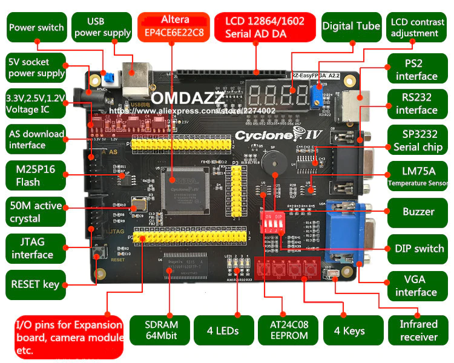
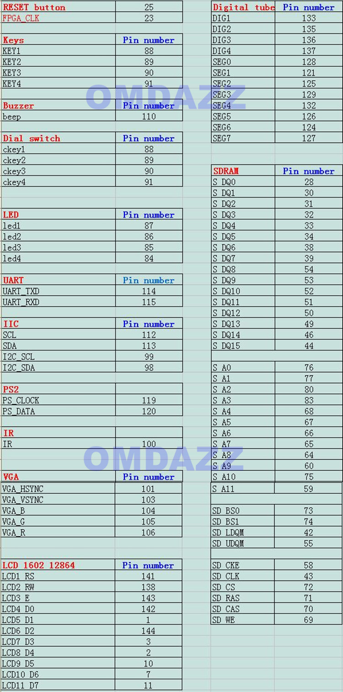

# ZX Spectrum на плате EP4CE6E22C8

Реализация ZX Spectrum на FPGA для недорогой отладочной платы
**OMDAZZ / RZ-EasyFPGA A2.2** (Altera Cyclone IV E, EP4CE6E22C8).

Ядро происходит от [ZX Spectrum для MiST](https://github.com/mist-devel/mist-board)
(в свою очередь основанного на «ZX Spectrum for Altera DE1» Майка Стирлинга),
но плата здесь принципиально проще: на ней нет ARM-контроллера ввода-вывода,
через который MiST-версия делала всё — от экранного меню до загрузки ПЗУ
и образов SD-карты. Всё это убрано и заменено на то, что плата умеет сама.

## Плата



Из того, что есть на плате, задействовано: 50 МГц кварц, SDRAM 64 Мбит,
разъём PS/2, VGA, пьезоизлучатель, четыре кнопки, четыре светодиода и
разъём I²C — его четыре вывода переиспользованы под SD-карту.

## Что реализовано

**Процессор.** T80 (Z80-совместимое ядро) с тактовой частотой
**3.5 / 7 / 14 / 28 МГц**, переключаемой на лету. Смена скорости
происходит только на безопасной границе: когда не открыт ни один цикл
обращения к памяти или порту и снят WAIT.

**Модели машины,** переключаются на лету без сброса:

| модель | кадр | строка | прерывание |
|---|---|---|---|
| Sinclair 48K | 69888 тактов | 224 такта | строка 248 |
| Sinclair 128K / +2 | 70908 | 228 | строка 245 |
| Sinclair +2A / +3 | 70908 | 228 | строка 245 |
| Pentagon 128K | 71680 | 224 | строка 239 |

**Contention ULA.** Опубликованная таблица задержек `6,5,4,3,2,1,0,0`,
128 тактов из 224 на каждой из 192 строк изображения. Отдельно
обрабатывается contention портов ввода-вывода по четырём случаям
(`N:1,C:3` / `N:4` / `C:1,C:3` / `C:1×4`). На Pentagon contention нет,
как и на настоящей машине. Режим переключается с клавиатуры — это
рабочий инструмент для сверки таймингов с эталоном.

**Память.** Одна микросхема SDRAM обслуживает и процессор, и видео через
арбитр со слотами. На Pentagon доступно расширение до 1024 КБ.

**Видео.** Выход VGA. На плате по одному выводу на цвет, поэтому
выводятся восемь базовых цветов; атрибут яркости по-прежнему
декодируется и влияет на логику программ, но на экране не виден.
Реализованы бордюр с корректной задержкой и порт 0xFF (floating bus).

**Звук.** AY-3-8912 (через YM2149) в конфигурации Turbo Sound плюс
бипер, сведённые в моно и выведенные на пьезоизлучатель через
однобитный сигма-дельта ЦАП.

**DivMMC + ESXDOS.** SD-карта подключается к четырём выводам разъёма
I²C. Образ ESXDOS зашит в блочную память и при включении копируется в
SDRAM небольшим автоматом — это заменяет загрузку через SPI, которой
занимался контроллер MiST. Автомаппер работает на всех частотах,
включая 28 МГц.

**Клавиатура.** PS/2 напрямую с разъёма платы.

## Управление

### Функциональные клавиши PS/2

| клавиша | действие |
|---|---|
| F1 / F2 / F3 / F4 | тактовая частота 3.5 / 7 / 14 / 28 МГц |
| F5 / F6 / F7 / F8 | модель: 48K / 128K / +2A+3 / Pentagon |
| F9 | расширение 1024 КБ (только на Pentagon) |
| F10 | режим contention: полный → выключен → только память |
| F11 | сброс |
| F12 | NMI (вход в меню ESXDOS) |

Смена модели намеренно **не сбрасывает** машину, чтобы можно было
наблюдать эффект на работающей программе. Смена объёма памяти при этом
почти наверняка уронит программу — банки уезжают у неё из-под ног;
для сброса есть F11.

### Кнопки платы

| кнопка | действие |
|---|---|
| KEY1 | сброс |
| KEY2 | NMI |
| KEY3 / KEY4 | сдвиг окна contention на такт назад / вперёд |

### Светодиоды

Активны низким уровнем. Нумерация на шёлкографии платы идёт **в обратном
порядке** к индексам `LED[]` в исходниках, поэтому ниже указана функция
и вывод ПЛИС:

| сигнал | вывод | горит, когда |
|---|---|---|
| `LED[3]` | 84 | активен DivMMC |
| `LED[2]` | 85 | contention только по памяти |
| `LED[1]` | 86 | contention выключена |
| `LED[0]` | 87 | включено расширение 1024 КБ |

Полный contention — состояние, в котором `LED[1]` и `LED[2]` погашены.

## Распиновка



Задействованные выводы:

| назначение | выводы |
|---|---|
| Кварц 50 МГц | 23 |
| Кнопки KEY1..KEY4 | 88, 89, 90, 91 |
| Светодиоды | 87, 86, 85, 84 |
| VGA HS / VS / R / G / B | 101, 103, 106, 105, 104 |
| PS/2 CLK / DATA | 119, 120 |
| Пьезоизлучатель | 110 |
| SD SCK / MOSI / CS / MISO | 112, 113, 99, 98 |
| SDRAM | шина данных, адреса и управления — см. таблицу выше |

SD-карта подключена к разъёму I²C: `SCL` → SCK, `SDA` → MOSI,
`I2C_SCL` → CS, `I2C_SDA` → MISO.

## Сборка

Требуется Quartus II 13.1.

```sh
./build.sh          # собрать, проверить тайминги, прошить плату
./build.sh --no-pgm # только собрать и проверить
```

Скрипт намеренно **отказывается прошивать сборку, не закрывшую
тайминги**. Quartus сообщает о нарушении временных требований как о
critical warning и всё равно завершается с кодом 0, поэтому проверки по
кодам возврата недостаточно: однажды на плату уже попала сборка с
запасом −1.85 нс, которая просто не могла работать.

Есть и `Makefile` с целями `map` / `fit` / `asm` / `run` для сборки по
шагам.

ПЗУ зашиваются в блочную память на этапе синтеза: `48.hex` (Spectrum 48K)
и `esxmmc.hex` (ESXDOS). Исходные двоичные образы лежат в [rom/](rom/).

## Симуляция

В [simulation/modelsim/](simulation/modelsim/) собран стенд, где **весь
дизайн целиком** работает против поведенческих моделей SDRAM и SD-карты
на реальных тактовых соотношениях. Это принципиально: все предыдущие
стенды заменяли память мгновенным массивом и потому не могли показать
главное — как процессор и видео дерутся за одну микросхему SDRAM.

```sh
vsim +ROM=rom48_plain.hex +SPEED=0 +CONT=2 +RUNLEN=44900 \
     -L altera_mf -do "run 45000us; quit -f" -c work_full.tb_top
```

Основные плюс-аргументы `tb_top.v`:

| аргумент | назначение |
|---|---|
| `+ROM=<файл>` | образ ПЗУ для прогона |
| `+SPEED=0..3` | частота процессора 3.5 / 7 / 14 / 28 МГц |
| `+LIVESPEED=1..3` | переключение частоты на ходу, как нажатием клавиши |
| `+CONT=0..2` | режим contention: нет / память / полный |
| `+RUNLEN=<мкс>` | длительность прогона |
| `+PCTRACE`, `+FETCHLOG=<файл>` | трассировка выборок команд |
| `+NMITEST` | подать NMI и проверить вход автомаппера |

Стенд печатает измерения, а не только «прошло/не прошло»: длительность
кадра, длину импульса прерывания в тактах реального времени и в тактах,
которые процессор успел выполнить, число тактов прерывания IM1,
таблицу задержек contention отдельно по чтениям, записям и портам,
задержки видеовыборок и счётчики обращений процессора к памяти.

Последнее — не формальность. «Регрессия чистая» ничего не значила,
пока счётчики показывали `CPU RAM writes: 0` и `DivMMC SPI: 0 port
accesses`: путь, ради которого делался прогон, просто не выполнялся.

## Структура исходников

| файл | назначение |
|---|---|
| [spectrum_top.v](spectrum_top.v) | верхний уровень: арбитр SDRAM, копирование ПЗУ при включении, турбо, contention, выбор модели, страничная память |
| [video.v](video.v) | ULA: развёртка, выборка изображения, бордюр, прерывание, окно contention |
| [clocks.v](clocks.v) | делители тактов и разрешения для процессора, звука, видео и арбитра |
| [T80/](T80/) | процессорное ядро Z80 |
| [divmmc.v](divmmc.v), [spi.v](spi.v) | DivMMC и SPI-обмен с SD-картой |
| [keyboard.v](keyboard.v), [ps2_intf.v](ps2_intf.v) | клавиатура PS/2 |
| [ula_port.v](ula_port.v) | порт 0xFE |
| [YM2149/](YM2149/) | звуковой сопроцессор |
| [sdram_ep4ce.v](sdram_ep4ce.v) | контроллер SDRAM для микросхемы этой платы |
| [rom48.v](rom48.v), [rom_esxdos.v](rom_esxdos.v) | ПЗУ в блочной памяти |

## Происхождение и лицензии

Проект собран из кода нескольких авторов; в каждом файле сохранён
оригинальный копирайт, а внесённые здесь изменения отмечены блоком
`Modifications copyright` со списком того, что именно исправлено.

| код | автор | лицензия |
|---|---|---|
| ZX Spectrum for Altera DE1 (`video.v`, `keyboard.v`, `ula_port.v`, `clocks.v`) | Mike Stirling, 2009–2011 | BSD-подобная, некоммерческое использование |
| T80 | Daniel Wallner, 2001–2002; доработки MikeJ, Sean Riddle, TobiFlex | BSD-подобная |
| YM2149 | MikeJ, 2005 | BSD-подобная |
| Контроллер SDRAM | Till Harbaum, 2013 | GPL v3 |
| SPI | по мотивам проекта ZX-Uno | — |
| Порт на эту плату и все правки | Sergey Potapov (potapov.sergey.77@gmail.com), 2026 | лицензии исходников сохраняются |

`sdram_ep4ce.v` — производная работа от кода под GPL v3 и
распространяется на тех же условиях. Образ ESXDOS принадлежит его
авторам ([esxdos.org](https://www.esxdos.org/)), тело мегафункции
altpll в `pll_ep4ce.v` сгенерировано Quartus и остаётся под лицензией
Altera/Intel.

## Состояние

Работает: турбо на всех частотах, DivMMC и ESXDOS на всех частотах
включая 28 МГц, тайминги Pentagon, звук, клавиатура, видео.

В работе: тайминги растра 48K. Полоса на бордюре в тестах смещена
относительно эталона, и измеренная длительность импульса прерывания
зависит от режима contention, хотя импульс формируется видеосчётчиком и
зависеть от этого не может. Разбирательство идёт: см. сравнение нашей
модели contention с
[описанием на sinclair.wiki.zxnet.co.uk](https://sinclair.wiki.zxnet.co.uk/wiki/Contended_memory)
в комментариях к `spectrum_top.v` — привязка задержки к сигналу MREQ
соответствует поведению позднего гейт-массива Amstrad (+2A/+3), тогда
как ранняя ULA 48K/128K применяет её независимо от MREQ.
